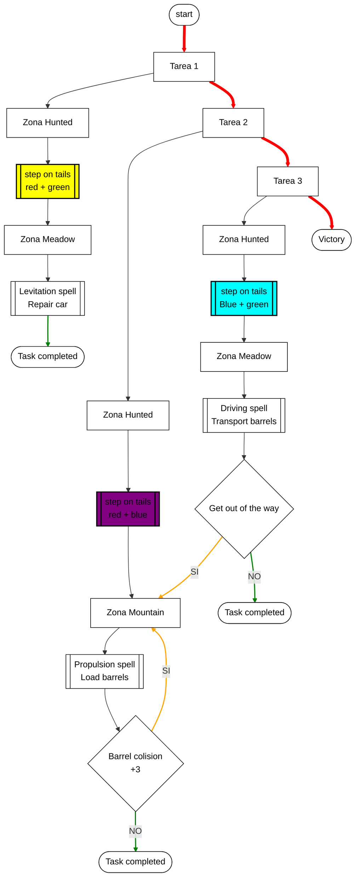
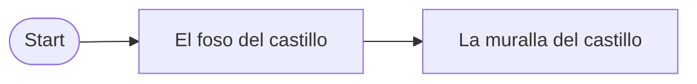
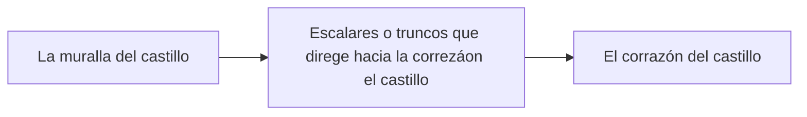
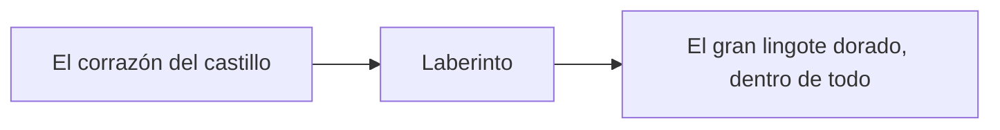

# DEV25-G03-P2
Repositorio creado por el gruopo G03 para el proyecto de Aprendiz de Brujo

# Punto de partida
Este proyecto está basado con el Unreal Engine 5.6 partiendo de la plantilla Top Down (sin variantes) que ofrece Unreal Engine, que recrea un mundo 3D con vista cenital en tercera persona, con el movimiento del avatar controlado por el ratón. Además hemos usado contenido del paquete Starter Content y de la tienda Fab, y hemos usado la biblioteca de Quixel Megascans para añadir objetos o el recurso gratuito [Stylized Fantasy Provencal](https://www.fab.com/listings/ced19ea1-31ed-437f-ae64-2b6b1561fede)

# Aprendiz de Brujo
Este proyecto consiste en desarrollar el prototipo ejecutable de un videojuego para un sólo jugador en forma de aventura con pequeños puzles físicos basados en realizar «mágicamente» tareas domésticas, tomando la inspiración de la película de Fantasía. Es un juego de puzles, sin enemigos ni posibilidad de recibir daño o morir.

# Instalación y uso

Los ficheros más importantes del proyecto están disponible en este repositorio, aunque puede que algunos binarios potencialmente grandes estén en el almacén GitHub LFS y se requiera tener activa la extensión Git LFS. El resto de los ficheros, generalmente de contenido más pesado o creado por terceros y sin intención de ser modificado en este proyecto, tendrá que descargarse de carpetas compartidas en [Google Drive](https://drive.google.com/drive/folders/1TfoB5S3yQw49-onoFfn0q79PTfk2RoSE) con ficheros ZIP, para después descomprirlos directamente en la carpeta Content.

Para este proyecto hace falta descargar los ficheros ZIP:

------------------------------------------------------------------cut from here--------------------------------------

- Characters
- LevelPrototyping
- ThirdPerson
- Variant_Platforming

Y luego extraerlos dentro del archivo **Content**
 
# Preproducción

El diseño tiene estas secciones:

- [Estetica](#Estetica)
    - [Grafico](#Grafico)
    - [Sonido](#Sonido)
- [Dinamica](#Dinamica)
    - [Objetivo](#Objetivo)
    - [Castigo](#Castigo)
- [Mecanica](#Mecanica)
- [Contenido](#Contenido)
    - [Zona A](#Zona-A)
    - [Zona B](#Zona-B)
    - [Zona C](#Zona-C)

# Estetica

El entorno virtual se basa en la plantilla Third Person que ofrece Unreal Engine, que recrea un mundo 3D con vista en tercera persona, a través de una cámara que sigue al avatar; además se incluye el contenido del paquete Starter Content. 

## Grafico

El juego usa solamente el contenido de la plantilla proporcinada por el profesor.

## Sonido

Debido a la falta de tiempo, hemos decidido a no implenmentar sonido en este poyecto.

# Dinamica

La dinámica del juego se basa en resolver pequeños puzles dentro de un juego con simulación física: manejamos al aprendiz en las inmediaciones del caserón del brujo y tendremos que usar nuestros poderes para realizar todas las tareas domésticas que nos ha encargado el maestro.

## Objetivo

El objetivo del juego es pasar por todas las pruebas hasta llegar a la corazón del castillo.

## Castigo

El jugador puede morirse en el caso de ser golpeado por barriles o balas de cañon, o caido en la agua. Cuando esto pase, volverá al inicio del nivel o al checkpoint depende de la zona que está el jugador.
Posible mejora (a evaluar)
Suponiendo parametro de vida, si el avatar muere supondria "game over" y deberia reiniciar desde el principio.

# Contenido

A continuación se muestra los componentes del juego.

## Avatar(caracter controlado por el jugador)

El clásico maniquí de Unreal Engine que se puede mover y saltar es el avatar que controla el jugador.

## Pastillas energéticas

Son unos objetos de forma pastilla, cual dará una habilidad de super salto, y se desaparece una vez sido tomada.

## El gran lingote dorado

Es el objeto con cual se gana el jugador.

# Contenido

A continuación se muestra las escenas del juego.

## Zona A

La primera zona del juego es un exterior con agua y consiste en cruzar el foso del castillo dando saltos sobre gruesos troncos que flotan sobre el agua, moviéndose lentamente bajo nuestros pies. Si el avatar cae al agua, muere pero reaparece al principio

## Zona B

La segunda zona consiste en escalar la muralla del castillo aprovechando sus salientes, siendo necesario el uso de pastillas para saltar entre ciertas plataformas. Aunque prime la verticalidad, conviene dividir la escalada en partes, de modo que si el avatar cae, sólo tiene que repetir la escalada de la última parte. Algún saliente estará dañado y se romperá si el avatar lo pisa.

## Zona C

La tercera y última zona es un interior y consiste en atravesar las estancias interiores hasta el corazón del castillo, con varias puertas y algunas trampas. No hay “enemigos” como tales, sólo objetos con movimiento que resultan molestos e incluso mortales para el jugador, y las llaves de las puertas mencionadas anteriormente. Si el avatar muere, será necesario repetir la zona. Finalmente al coger el gran lingote dorado en el interior del castillo, la partida termina.

# Referencia

[Fūun! Takeshi Jō]( https://narratech.com/es/desarrollo-de-videojuegos-25-26/)

[Castle - Base](https://github.com/narratech/castle-base)

# Video demo
https://drive.google.com/drive/folders/14ALIV9pRV7xGzeA53S0Z2yKjn5nXuOZI?usp=sharing

El enlace contiene videos de visibilidad de todos los escenarios y videos de jugabilidad

