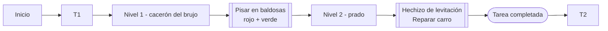

# DEV25-G03-P2
Repositorio creado por el gruopo G03 para el proyecto de Aprendiz de Brujo

# Punto de partida
Este proyecto está basado con el Unreal Engine 5.6 partiendo de la plantilla Top Down (sin variantes) que ofrece Unreal Engine, que recrea un mundo 3D con vista cenital en tercera persona, con el movimiento del avatar controlado por el ratón. Además hemos usado contenido del paquete Starter Content y de la tienda Fab, y hemos usado la biblioteca de Quixel Megascans para añadir objetos o el recurso gratuito [Stylized Fantasy Provencal](https://www.fab.com/listings/ced19ea1-31ed-437f-ae64-2b6b1561fede)

# Aprendiz de Brujo
Este proyecto consiste en desarrollar el prototipo ejecutable de un videojuego para un sólo jugador en forma de aventura con pequeños puzles físicos basados en realizar «mágicamente» tareas domésticas, tomando la inspiración de la película de Fantasía. Es un juego de puzles, sin enemigos ni posibilidad de recibir daño o morir.

# Instalación y uso

Los ficheros más importantes del proyecto están disponible en este repositorio, aunque puede que algunos binarios potencialmente grandes estén en el almacén GitHub LFS y se requiera tener activa la extensión Git LFS. El resto de los ficheros, generalmente de contenido más pesado o creado por terceros y sin intención de ser modificado en este proyecto, tendrá que descargarse de carpetas compartidas en [Google Drive](https://drive.google.com/drive/folders/1TfoB5S3yQw49-onoFfn0q79PTfk2RoSE) con ficheros ZIP, para después descomprirlos directamente en la carpeta Content.

Para este proyecto hace falta descargar los ficheros ZIP:

- Cursor
- [Stylized Fantasy Provencal](https://www.fab.com/listings/ced19ea1-31ed-437f-ae64-2b6b1561fede)
- TopDown
- StarterContent

Y luego extraerlos dentro del archivo **Content**
 
# Preproducción

El diseño tiene estas secciones:

- [Estetica](#Estetica)
    - [Grafico](#Grafico)
    - [Sonido](#Sonido)
- [Dinamica](#Dinamica)
    - [Objetivo](#Objetivo)
    - [Castigo](#Castigo)
- [Mecanica](#Mecanica)
- [Contenido](#Contenido)
    - [Tarea 1](#Tarea-1)
    - [Tarea 2](#Tarea-2)
    - [Tarea 3](#Tarea-3)

# Estetica

El entorno virtual se basa en la plantilla Top Down (sin variantes) que ofrece Unreal Engine, que recrea un mundo 3D con vista cenital en tercera persona, con el movimiento del avatar controlado por el ratón. 

## Grafico

El juego usa solamente el contenido de la plantilla proporcinada por el profesor.

## Sonido

Debido a la falta de tiempo, hemos decidido a no implenmentar sonido en este poyecto.

# Dinamica

La dinámica del juego se basa en resolver pequeños puzles dentro de un juego con simulación física: manejamos al aprendiz en las inmediaciones del caserón del brujo y tendremos que usar nuestros poderes para realizar todas las tareas domésticas que nos ha encargado el maestro.

## Objetivo

El objetivo del juego es el cumplimiento secuencial de todas las tareas del aprendiz del brujo, las cuales son 3.

## Castigo

En la tarea 2 al momento de empujar los barrile hacia el carro, si un barril choca contra otros objetos del escenario que no sean el carro arreglado, recibe daño y si acumula 3 daños, se destruye y desaparece (reapareciendo en su sitio original otra vez a los 5 segundos).

En la tarea 3 al momento de transportar los barriles por el camino en direccion al molino, si se en esta conduccion se sale del camino totalmente, el carro vuelve a aparecer en su posición inicial pero sin barriles, con lo que habría que repetir la segunda tarea.

# Contenido

A continuación se muestra los componentes del juego.

## Avatar(caracter controlado por el jugador)

El clásico maniquí de Unreal Engine que se puede mover y saltar es el avatar que controla el jugador.

## Badosas

Son 3 objetos en forma de plataformas o baldosas magicas. Cuando el avatar, las pisa en una combinacion especifica, se activa una habilidad magica especial.

# Contenido

A continuación se muestra las tareas del juego.

## Tarea 1

La primera tarea se realiza en el prado, cerca de la fachada del caserón y consiste en arreglar el carro, al que le falta una rueda y está volcado en el suelo, con la rueda de repuesto sin instalar y brillando con cierta luz amarilla. Cuando la luz de las baldosas es amarilla (baldosas roja y verde activas a la vez) haciendo clic derecho se realiza el hechizo de levitación: con el movimiento del ratón controlamos la rueda para llevarla volando por el aire a su posición correcta en el carro, quedando este arreglado «mágicamente» en cuanto la acerquemos a su sitio.

## Tarea 2

La segunda tarea se realiza en la cima de la momntaña y consiste en cargar 3 barriles de trigo en el carro, para lo que es necesario en primer lugar que el carro esté arreglado (listo para recibir los barriles). En la cima de la momntaña hay muchos barriles disponibles -brillando con cierta luz morada- pero pesan demasiado, por lo que hay que ponerse cerca de ellos, apuntar en dirección al carro y «empujarlos» (haciendo clic derecho) monte abajo gracias al hechizo de propulsión. Este se activa cuando la luz de las baldosas es morada (baldosas roja y azul activas a la vez), haciendo que caigan rodando y -con suerte- acaben cerca del carro arreglado. Si un barril choca contra otros objetos del escenario que no sean el carro arreglado, recibe daño y si acumula 3 daños, se destruye y desaparece (reapareciendo en su sitio original otra vez a los 5 segundos).

## Tarea 3

La tercera y última tarea se realiza también en el prado, yendo hacia el molino que está situado al este del caserón. En este nivel hay un río que dificulta llegar al molino, pero afortunadamente hay un puente que nos permite cruzar sobre él. Conduciendo debidamente el carro (arreglado y cargado -brillando con cierta luz cian-) a lo largo del camino que cruza dicho puente se llega al pie del molino. Es un camino bastante tortuoso que, con el hechizo de conducción activo (luz de las baldosas cian, es decir, verde y azul a la vez) y haciendo clic derecho podemos empezar a recorrer. Lo primero es «tomar el control» del carro con una cámara muy cercana, en primera persona, y después hacemos que este se mueva sólo, mágicamente. El movimiento del ratón permite girar nuestro vehículo-avatar levemente a izquierda o derecha, mantener el clic izquierdo pulsado hace que el carro acelere y soltarlo permite disminuir la velocidad, aunque tiene bastante inercia. Si nos salimos totalmente del camino, el carro vuelve a aparecer en su posición inicial pero sin barriles, con lo que habría que repetir la segunda tarea. Cuando se termina esta tercera tarea, el juego ha sido completado y vuelve a empezar desde el principio, aunque cada vez que se completa se añade un saco de harina dentro del caserón, como trofeo y prueba permanente de los méritos del jugador.

# Referencia

[Enunciado de la practica](https://narratech.com/es/desarrollo-de-videojuegos/contenido/aprendiz-de-brujo/)

# Video demo

El enlace contiene videos de visibilidad de todos los escenarios y videos de jugabilidad

